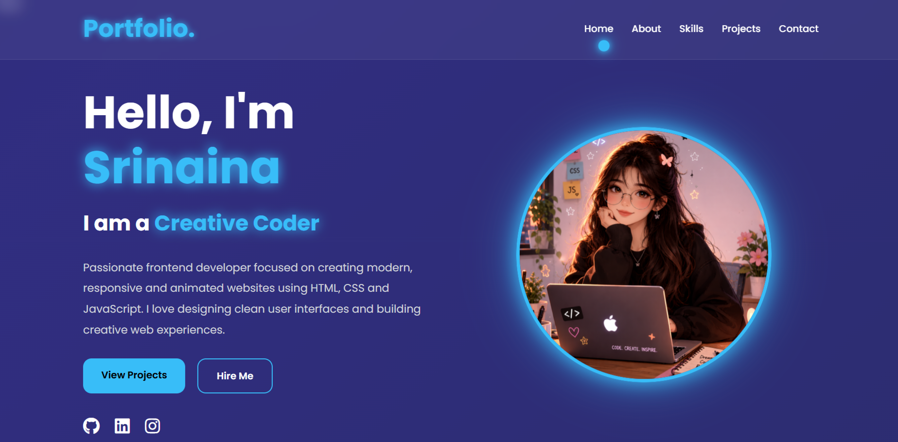

# 🌐 Modern Portfolio Website

A fully responsive and animated personal portfolio website built using **HTML, CSS, and JavaScript** with a modern glassmorphism-inspired UI and smooth interactive effects.

---

## ✨ Features

* 🎨 Modern & Premium UI Design
* 📱 Fully Responsive Layout
* ⚡ Smooth Scroll Animations
* ⌨️ Dynamic Typing Effect
* 🖱️ Custom Animated Cursor
* 💎 Glassmorphism Cards
* 🚀 Scroll To Top Button
* 🌈 Animated Gradient Background
* 🔗 Social Media Integration
* 📂 Project Showcase Section
* 📊 Skills & Statistics Section
* 🧠 Clean and Organized Code Structure

---

## 🛠️ Technologies Used

| Technology   | Purpose              |
| ------------ | -------------------- |
| HTML5        | Structure            |
| CSS3         | Styling & Animations |
| JavaScript   | Interactivity        |
| Font Awesome | Icons                |
| Google Fonts | Typography           |

---

## 📸 Preview


```

---

## 🚀 Live Demo

🌍 Website:

https://srinaina2007-sudo.github.io/CodeAlpha_Portfolio/

---

## 📁 Project Structure

```bash
CodeAlpha_Portfolio/
│
├── index.html
├── style.css
├── script.js
├── README.md
│
└── images/
    ├── profile.png
    ├── project1.png
    └── project2.png
```

---

## 💡 Key Highlights

* Smooth floating profile animation
* Interactive hover effects
* Mobile-friendly navigation
* Animated skill progress bars
* Professional project showcase
* Optimized UI spacing and layout

---

## 📬 Contact

📧 Email:
[srinaina2007@gmail.com](mailto:srinaina2007@gmail.com)

🔗 GitHub:
https://github.com/srinaina2007-sudo

🔗 LinkedIn:
https://www.linkedin.com/in/sri-naina-138006362

---

## 👩‍💻 Author

**Srinaina**
Frontend Developer & Creative UI Designer

---

## ⭐ Support

If you like this project, consider giving it a ⭐ on GitHub.

---
